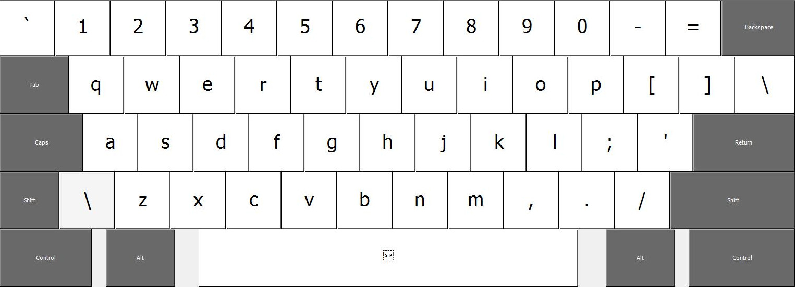
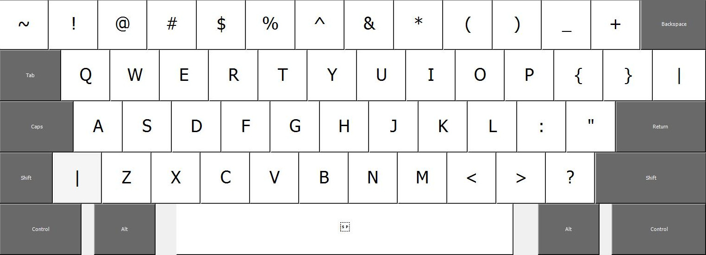
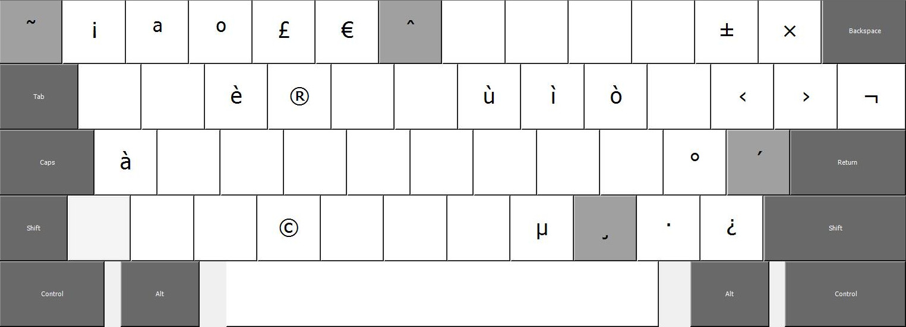
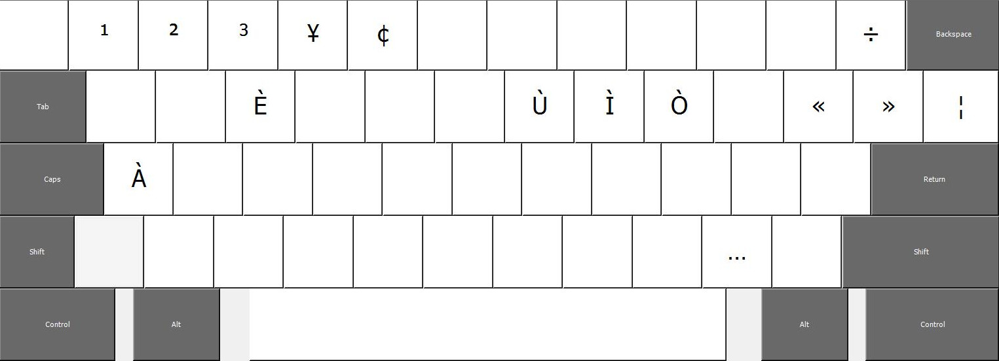

# us-ita-keyboard-layout
Modified version of the US keyboard layout for italian writing.

It provides ease of access to accents without using deadkeys like the US International Layout

## Layout
| Basic                  | Shift                     |
|------------------------|---------------------------|
|  |  |

| AltGr                      | AltGr + Shift                       |
|----------------------------|-------------------------------------|
|  |  |
